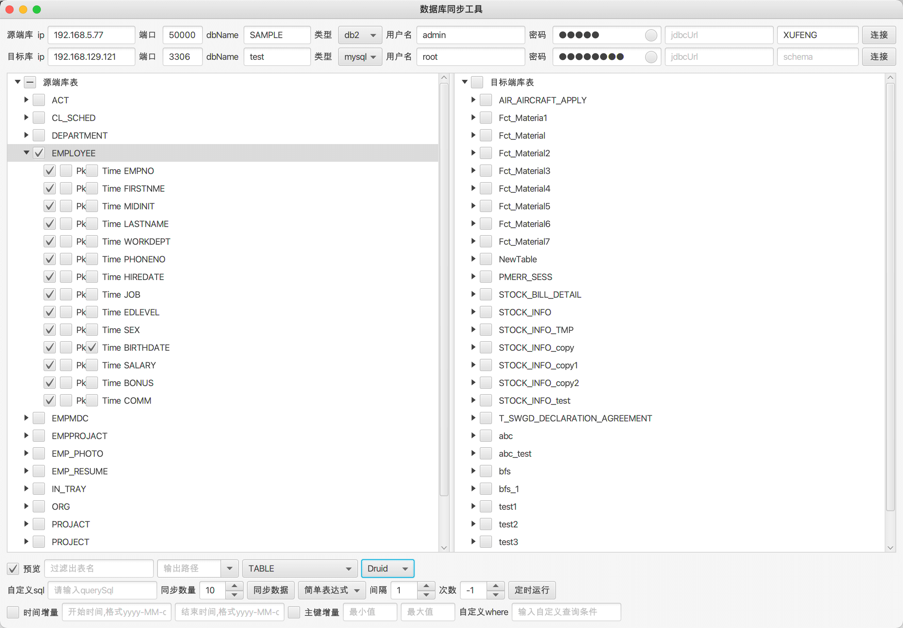

RdbmsSyncTool 关系型数据库同步工具

**xJavaFxTool交流QQ群：== [387473650](https://jq.qq.com/?_wv=1027&k=59UDEAD) ==**

#### 项目简介：
RdbmsSyncTool是使用javaFx开发的关系型数据库同步工具[xJavaFxTool](https://gitee.com/xwintop/xJavaFxTool)的插件集合，可实现打包后让框架自动加载，可在线下载和更新工具，后续小工具将在这个项目中添加，实现动态jar包加载。

目前支持的数据库类型有

#### 环境搭建说明：
- 开发环境为jdk1.8，基于maven构建
- 使用eclipase或Intellij Idea开发(推荐使用[Intellij Idea](https://www.jetbrains.com/idea/))
- 本项目使用了[lombok](https://projectlombok.org/),在查看本项目时如果您没有下载lombok 插件，请先安装,不然找不到get/set等方法
- 依赖的[xcore包](https://gitee.com/xwintop/xcore)已上传至git托管的maven平台，git托管maven可参考教程(若无法下载请拉取项目自行编译)。[教程地址：点击进入](http://blog.csdn.net/u011747754/article/details/78574026)

完成关系型数据库表结构获取，多种类型数据库直接数据转移，同步

#### 版本记录
- 1.0.0  20200419
  1. 完成基本功能配置（对表进行查询、删除、建表语句、同步数据等操作）
  2. 支持mysql、Oracle、sqlserver、PostgreSql、达梦等数据库连接
- 1.0.1  20200421
  1. 添加sqlite、h2、access数据库支持
  2. 优化数据同步功能
